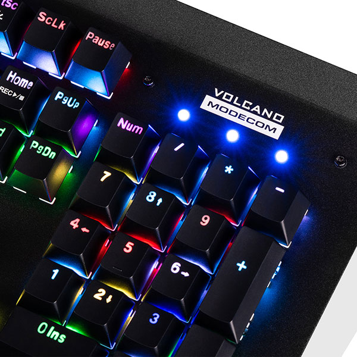

# Modecom Volcano Hammer 2 RGB for Linux


This CLI tool is designed to be used with Modecom Volcan Hammer 2 RGB keyboard. It (mostly)replicates what Windows
equivalent is doing; changing effect, color, brightness, speed. \
Also available in [AUR](https://aur.archlinux.org/packages/hammer2rgb) \
or as deb package: \
```
echo "deb [trusted=yes arch=amd64] http://spotless.fun/apt-repo stable main" >> /etc/apt/sources.list
sudo apt update --allow-insecure-repositories
sudo apt install hammer2rgb
```

## Usage
Building:
> ./configure \
> make \
> make install

Use:
> hammer2rgb [EFFECT] ... [COLOR] [SPEED] [BRIGHTNESS]

You always have to specify effect when changing color, speed or brightness.

Eg.
> hammer2rgb fixed_on green

Options can be listed by running without any arguments \
Currenty only supports changing effects and using preset colors


### List of keyboard effects:
>snake \
>neon_stream \
>reaction \
>sine_wave \
>fixed_on \
>respire \
>rainbow \
>flash_away \
>raindrops \
>rainbow_wheel \
>ripples_shining \
>stars_twinkle \
>shadow_disappear
### List of color presets:
>red \
>green \
>blue \
>yellow \
>purple \
>magenta \
>cyan \
>random_color

## TODO
- full color change
- speed change
- brightness change

## Versions
### 1.0
- basic functionality of changing keyboard effect and color preset